# CI Pipeline Flow Diagram

## Overview

This document visualizes how the CI pipelines work in this project.

## Trigger Flow

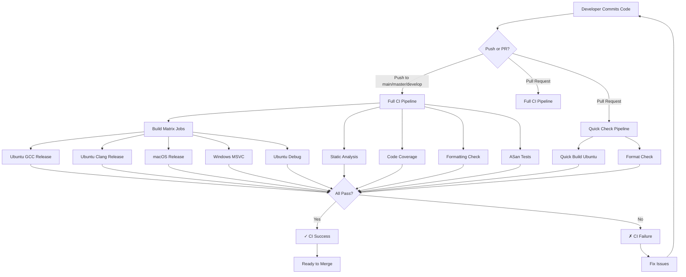

## Detailed Job Flow

### Main CI Pipeline (ci.yml)

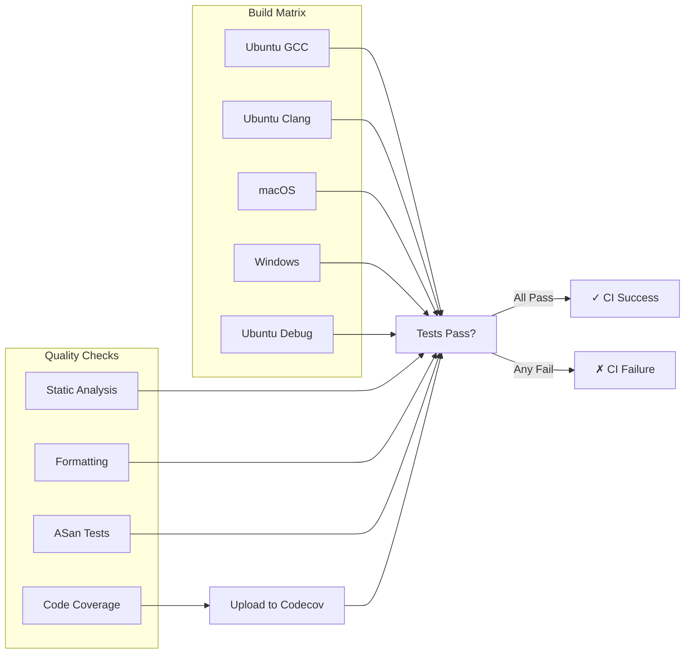

## Build Step Breakdown

### Individual Job Flow

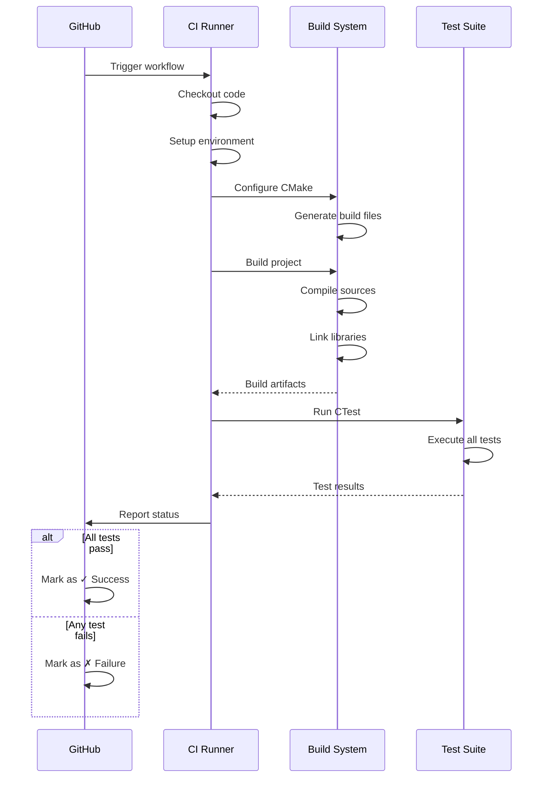

## Quick Check Pipeline Flow

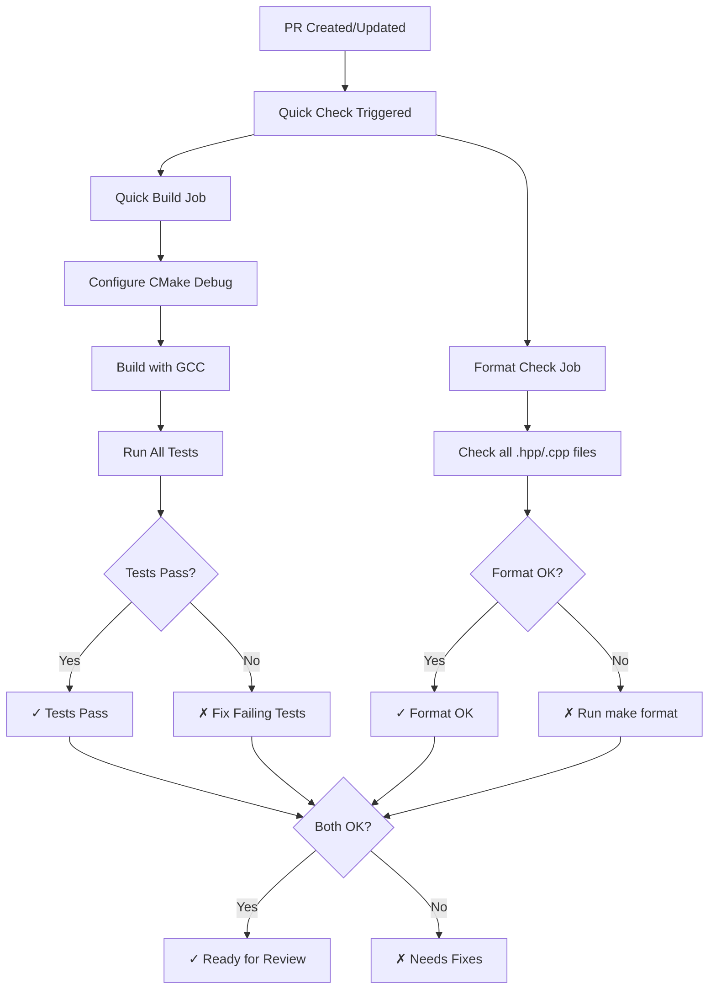

## Platform-Specific Workflow

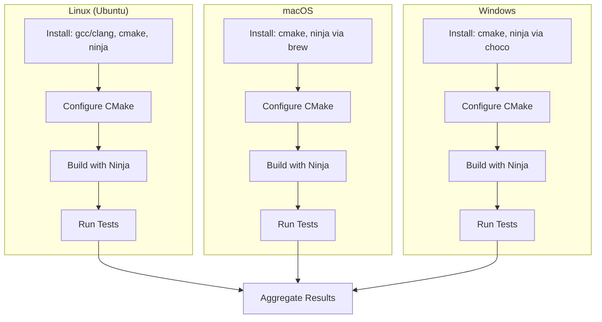

## Code Coverage Flow

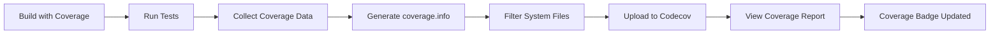

## Static Analysis Flow

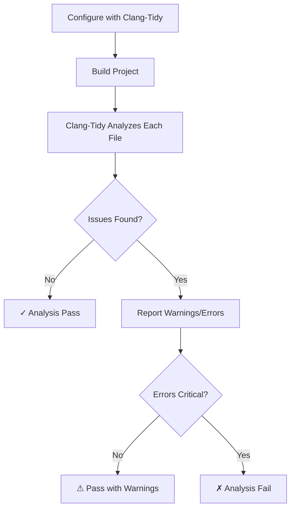

## Complete PR Workflow

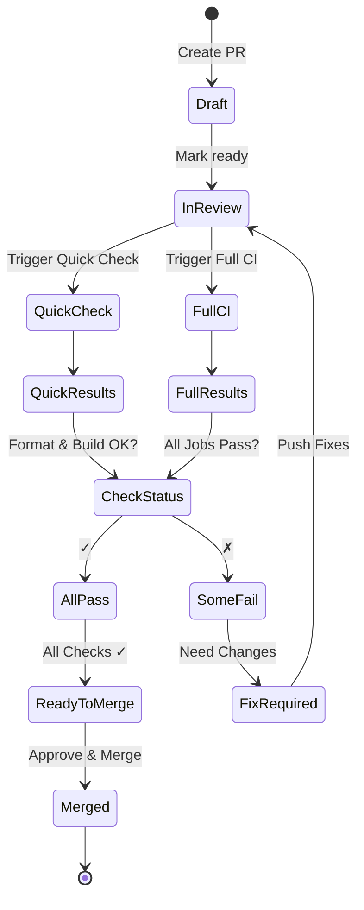

## Time Estimates

### Quick Check Pipeline
```
┌─────────────────────────────────┐
│ Quick Build:      ~2-3 minutes  │
│ Format Check:     ~30 seconds   │
│ Total:            ~2-3 minutes  │
└─────────────────────────────────┘
```

### Full CI Pipeline
```
┌─────────────────────────────────────────┐
│ Build Matrix (parallel):                │
│   - Ubuntu GCC:        ~3-4 minutes     │
│   - Ubuntu Clang:      ~3-4 minutes     │
│   - macOS:             ~4-5 minutes     │
│   - Windows:           ~5-6 minutes     │
│   - Ubuntu Debug:      ~3-4 minutes     │
│                                          │
│ Static Analysis:       ~4-5 minutes     │
│ Code Coverage:         ~4-5 minutes     │
│ Formatting:            ~30 seconds      │
│ ASan:                  ~4-5 minutes     │
│                                          │
│ Total (parallel):      ~6-8 minutes     │
└─────────────────────────────────────────┘
```

## Failure Handling

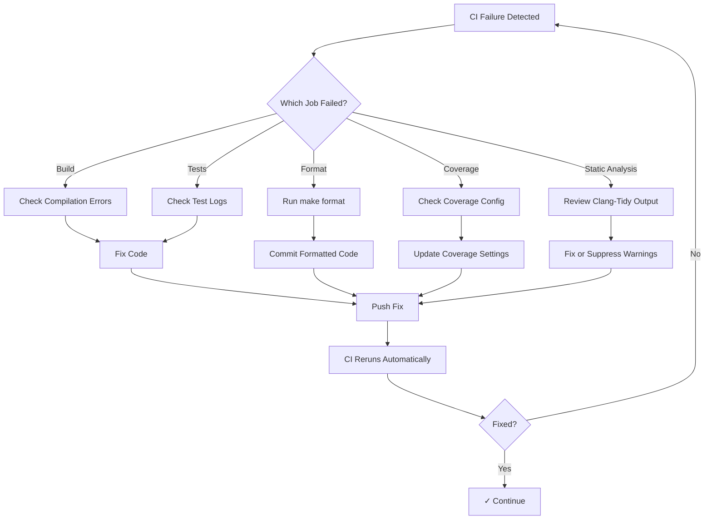

## Best Practices Flow

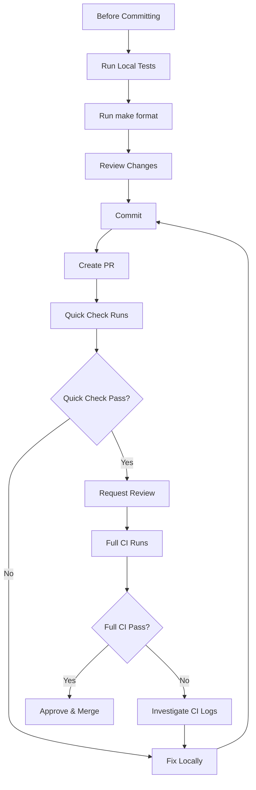

## Local Testing Recommendation

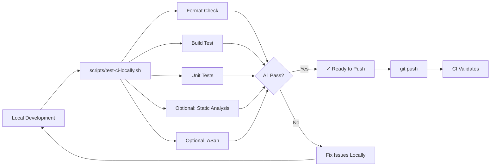

---

**Note:** All diagrams are in Mermaid format and will render automatically on GitHub and in compatible viewers.

