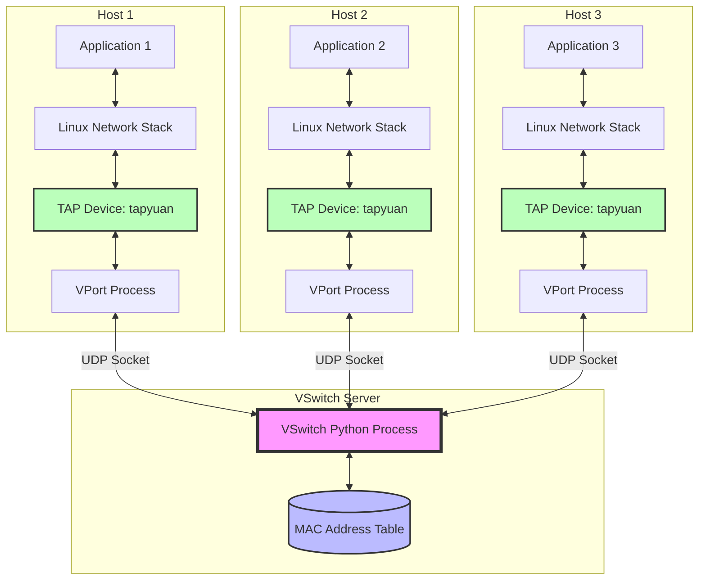
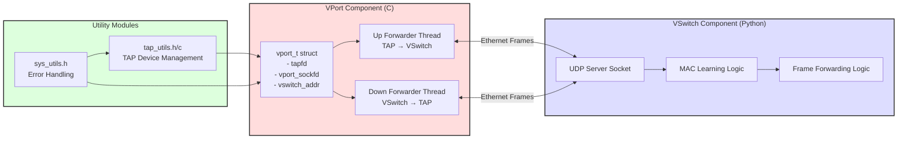
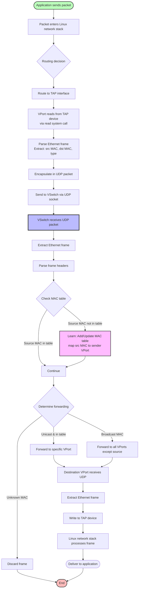
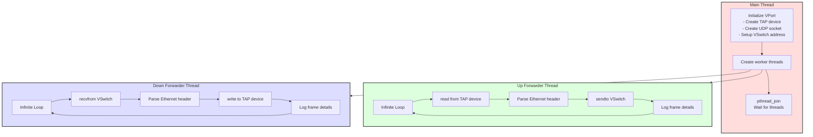
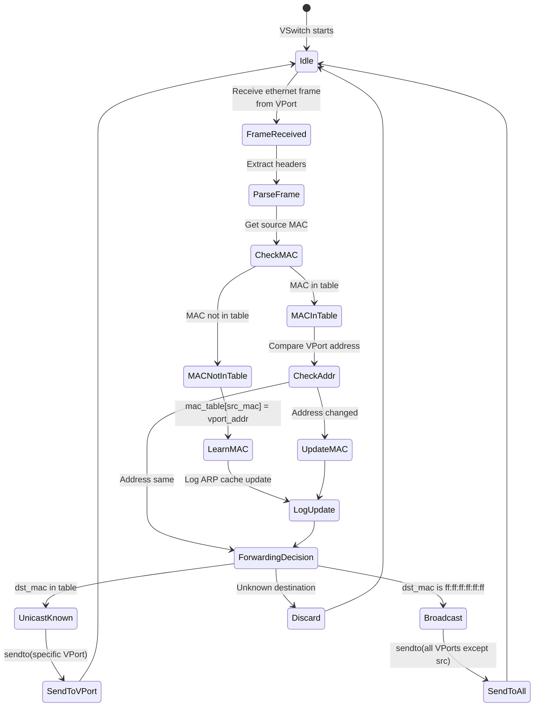

# Architecture Overview - Virtual Switch Network

## System Architecture

## Component Interaction Diagram

## Data Flow Architecture

## Threading Architecture

## MAC Learning State Machine

## Key Design Decisions

### 1. TAP Device (Layer 2)
- **Why TAP?**: Operates at Ethernet layer, allows full control over frames
- **Alternative TUN**: Would be Layer 3 (IP), less flexible for virtual networking

### 2. UDP for Transport
- **Advantages**: 
  - Low latency
  - No connection state
  - Simple broadcast/multicast support
- **Trade-offs**: No reliability guarantees (acceptable for local network simulation)

### 3. Learning Switch Algorithm
- **Dynamic MAC learning**: Adapts to network topology changes
- **Broadcast handling**: Enables ARP and other discovery protocols
- **Discard unknown**: Prevents unnecessary traffic (could implement flooding)

### 4. Threading Model
- **Separate threads for up/down**: Maximizes throughput, prevents blocking
- **Continuous polling**: Low latency at cost of CPU usage
- **Alternative**: Could use epoll/select for efficiency

### 5. Frame Processing
- **IFF_NO_PI flag**: Disables packet information header for simpler processing
- **ETHER_MAX_LEN buffer**: 1518 bytes (max standard Ethernet frame)
- **Minimum frame check**: Assert 14 bytes (Ethernet header size)

## Performance Considerations

### Latency Sources
1. **TAP device read/write**: Kernel → userspace transition
2. **UDP socket operations**: Network stack overhead
3. **Context switching**: Between threads and processes
4. **MAC table lookup**: O(1) dictionary access in Python

### Scalability
- **VSwitch bottleneck**: Single-threaded Python process
- **VPort parallelism**: Each runs independently
- **Network bandwidth**: Limited by UDP socket buffer sizes

### Optimization Opportunities
1. Use multi-threaded VSwitch
2. Implement zero-copy packet forwarding
3. Use hardware offloading (if available)
4. Optimize MAC table with C/C++ implementation
5. Consider using DPDK for high-performance packet processing

