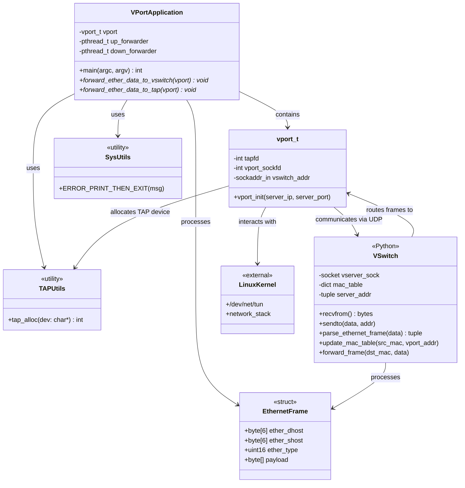

# Class Diagram - VPN Virtual Switch Architecture

## Overview
This diagram shows the structure and relationships of the virtual switch components.

## Component Descriptions

### VPort Components (C)

#### vport_t
The main VPort structure that maintains:
- **tapfd**: File descriptor for the TAP device (connection to Linux kernel)
- **vport_sockfd**: UDP socket for communication with VSwitch
- **vswitch_addr**: Address information for the VSwitch server

#### VPortApplication
The main application that:
- Creates and initializes a VPort instance
- Spawns two forwarding threads:
  - **up_forwarder**: Forwards ethernet frames from TAP device to VSwitch
  - **down_forwarder**: Forwards ethernet frames from VSwitch to TAP device

#### TAPUtils
Utility module for TAP device management:
- **tap_alloc()**: Allocates and configures a TAP device (IFF_TAP | IFF_NO_PI)

#### SysUtils
System utility macros:
- **ERROR_PRINT_THEN_EXIT**: Error handling macro for fatal errors

### VSwitch Component (Python)

#### VSwitch
A learning switch implementation that:
- Listens on UDP socket for ethernet frames from VPorts
- Maintains a MAC address table mapping MAC addresses to VPort addresses
- Forwards frames based on destination MAC:
  - Unicast: Forward to specific VPort if MAC is in table
  - Broadcast (ff:ff:ff:ff:ff:ff): Forward to all VPorts except source
  - Unknown: Discard frame

### Data Structures

#### EthernetFrame
Standard Ethernet II frame structure:
- 6-byte destination MAC address
- 6-byte source MAC address
- 2-byte EtherType field
- Variable-length payload

## Architecture Notes

1. **TAP Device**: Virtual network interface that appears as a real network device to the Linux kernel
2. **UDP Communication**: VPorts communicate with VSwitch using UDP sockets for low-latency frame forwarding
3. **MAC Learning**: VSwitch learns MAC-to-VPort mappings dynamically
4. **Threading**: Each VPort uses two threads for bidirectional forwarding

