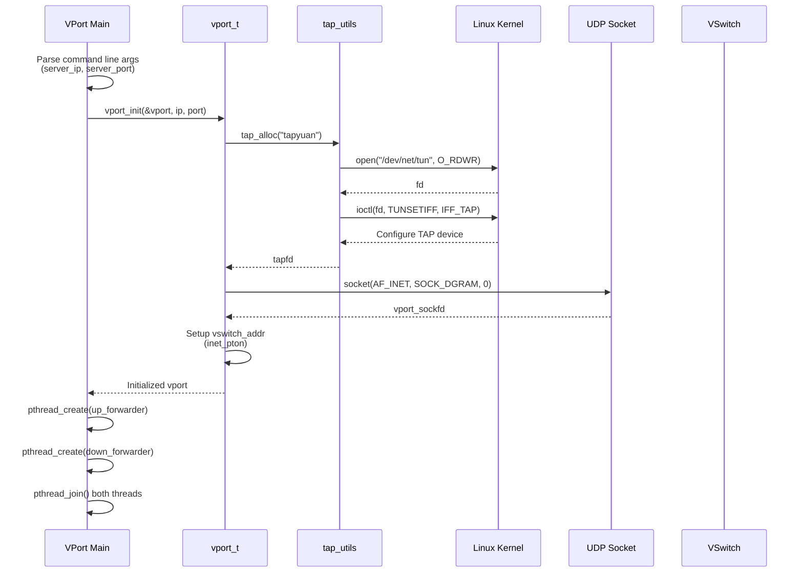
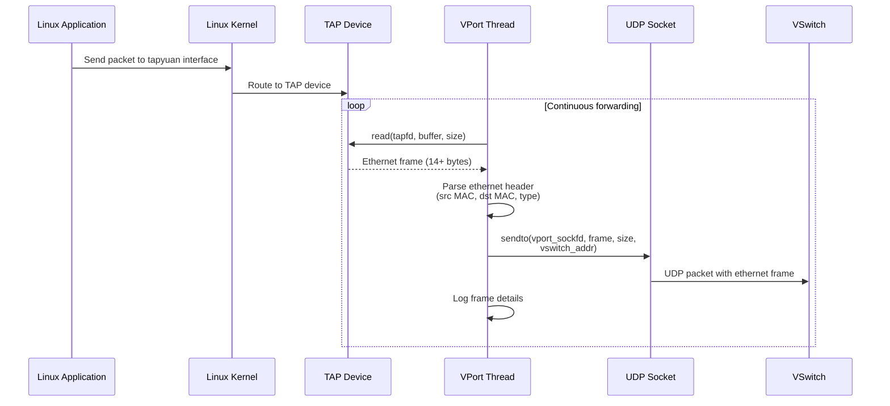
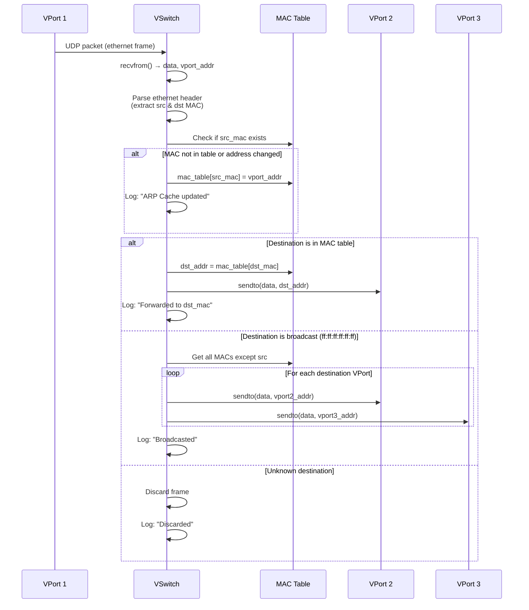
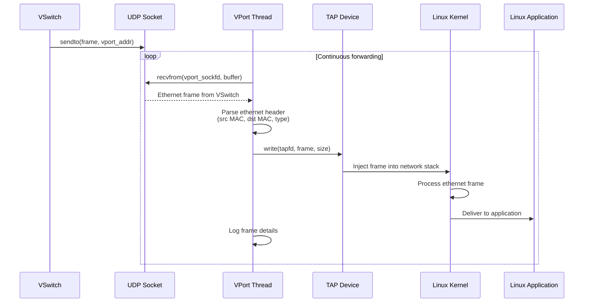
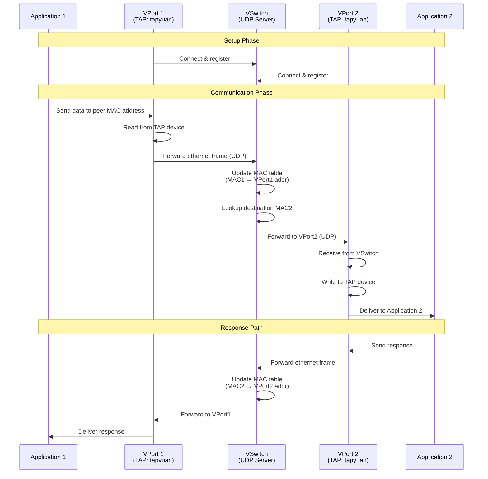
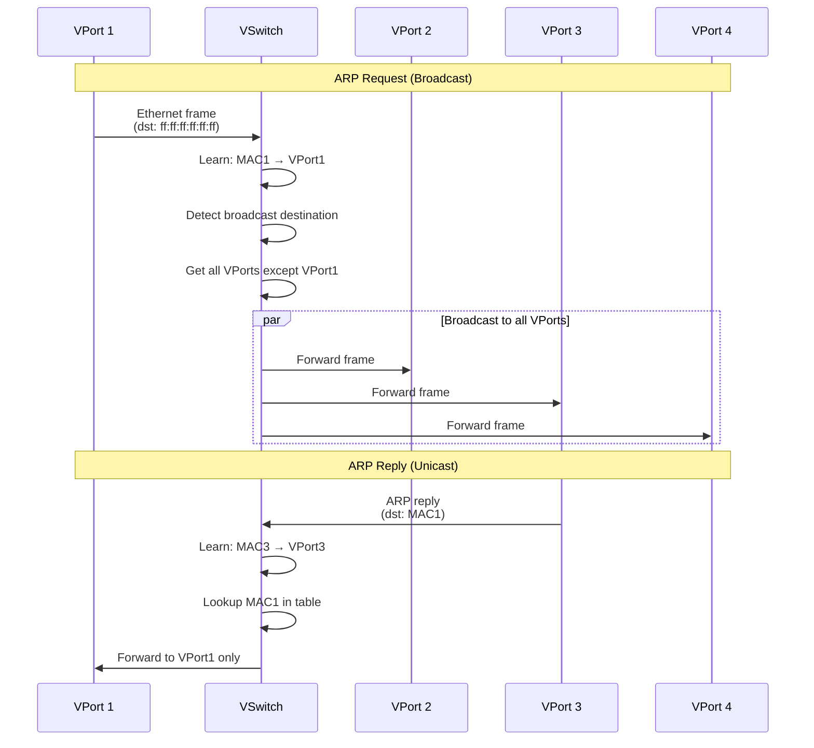

# Sequence Diagrams - VPN Virtual Switch Operations

## 1. VPort Initialization Sequence

## 2. Ethernet Frame Forwarding: TAP → VSwitch

## 3. VSwitch Frame Processing and Forwarding

## 4. Ethernet Frame Forwarding: VSwitch → TAP

## 5. Complete End-to-End Communication Flow

## 6. Multi-VPort Broadcast Scenario

## Operational Notes

### Threading Model
- **VPort**: Uses 2 threads per instance
  - Thread 1: Continuous read from TAP → forward to VSwitch
  - Thread 2: Continuous receive from VSwitch → write to TAP

### Error Handling
- Fatal errors use `ERROR_PRINT_THEN_EXIT` macro
- Size mismatches are logged but don't terminate execution
- Assertions verify ethernet frame minimum size (14 bytes)

### Performance Characteristics
- **UDP**: Low latency, no connection overhead
- **Zero-copy where possible**: Direct buffer forwarding
- **Non-blocking**: Continuous polling for frames
- **Learning Switch**: Dynamic MAC table for efficient forwarding

